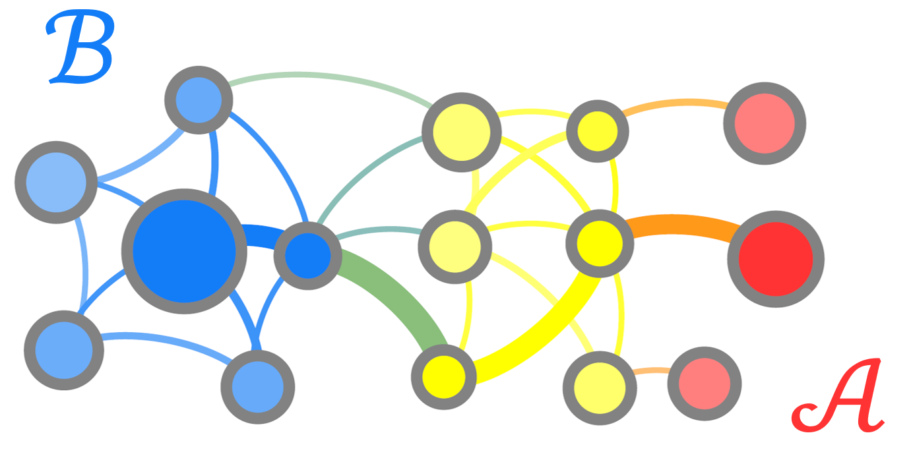

# Markov chain analysis and simulation with DISCOTRESS

<!-- <a href="#">DISCOTRESS</a> -->
<!--  -->

<!-- <img_src = "https://raw.githubusercontent.com/danieljsharpe/danieljsharpe/master/discotress_network_annotated.png" alt="Markov chain"> -->

<!--  -->

  
  <i>A finite Markov chain is a discrete-state model where edges connecting nodes of the network are associated with transition probabilities for a fixed time step (discrete-time Markov chain) or transition rates (continuous-time Markov chain). Often, we want to analyse the characteristic features of transitions from an intitial set of nodes, B, to a target set of nodes, A. Dynamical properties of interest include the occupation probabilities of nodes at equilibrium (illustrated by the sizes of nodes in the above image), the probabilities that nodes are visited along A &#8592 B trajectories (illustrated by the opacity of nodes), and the net A &#8592 B flux along edges (illustrated by the thickness of edges). These quantities, and many others, can be determined using <a href="https://github.com/danieljsharpe/DISCOTRESS">DISCOTRESS</a>, either through exact computation using numerically robust algorithms, or estimated from simulation data obtained using efficient sampling methods.</i> 

Finite Markov chains are network models commonly used to represent stochastic processes as varied as animal movement within an ecosystem 🦜🌴, the fluctuating status of financial markets 💸📈, and DNA or protein molecules folding to their functional structure 🧬🦠. [DISCOTRESS](https://github.com/danieljsharpe/DISCOTRESS) is a software package to analyse the dynamics of finite Markov chains. The capabilities of the software include exact computation of dynamical properties, such as the average time to reach a specifiied target state, and simulation of pathways on the network.

[DISCOTRESS](https://github.com/danieljsharpe/DISCOTRESS) is specifically designed to deal with Markov chains featuring a comparatively slow (i.e. low probability) event. This is a common feature of realistic dynamical models - for instance, daily trading leads to moderate market fluctuations 💱 and a dramatic stock market crash is improbable on any one day 📉. For Markov chains exhibiting rare event dynamics, standard algorithms to compute dynamical quantities are numerically unstable, and standard algorithms to simulate pathways are severely inefficient. DISCOTRESS includes a suite of advanced algorithms that negate these problems. Get started with the software [here](https://github.com/danieljsharpe/DISCOTRESS).

## About me

DISCOTRESS is developed by me, Daniel J. Sharpe. Currently, I am in the final year of my PhD at the University of Cambridge. Much of my work deals with the theory of Markov chains, but I am also interested in applications, especially to the modeling of ecological and economic systems.

I love wildlife, and in particular I am a bird enthusiast 🐦🦢🦚🦅🦉🦩🦜 I spend my free time sketching critters 🦌🐍🐠🦨🐦

<!--
**danieljsharpe/danieljsharpe** is a ✨ _special_ ✨ repository because its `README.md` (this file) appears on your GitHub profile.

Here are some ideas to get you started:

- 🔭 I’m currently working on ...
- 🌱 I’m currently learning ...
- 👯 I’m looking to collaborate on ...
- 🤔 I’m looking for help with ...
- 💬 Ask me about ...
- 📫 How to reach me: ...
- 😄 Pronouns: ...
- ⚡ Fun fact: ...
-->
